# Deploying Multi-Tier Application using Docker Compose
This repository demonstrates how to deploy a multi-tier web application using Docker Compose on an Amazon Web Services (AWS) EC2 instance. 
The application consists of a frontend (Apache web server), a backend (Python Flask API), and a database (MySQL).

## Overview
This setup provides a practical example of containerizing and deploying a typical web application architecture. 
Docker Compose simplifies the process of managing multiple Docker containers and their dependencies, making it easy to deploy the entire application stack as a single unit.

## Prerequisites
* **AWS Account:** You need an AWS account to create an EC2 instance.
* **Basic Docker Knowledge:** Familiarity with Docker concepts like images, containers, and Docker Compose is helpful.

## Set up an AWS EC2 Instance with Public IP
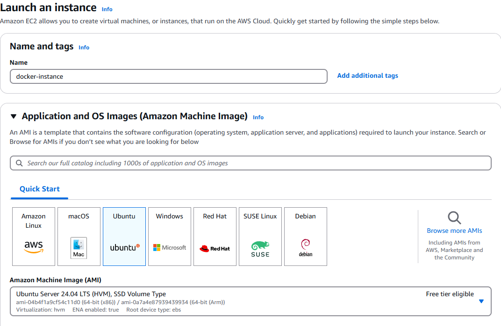
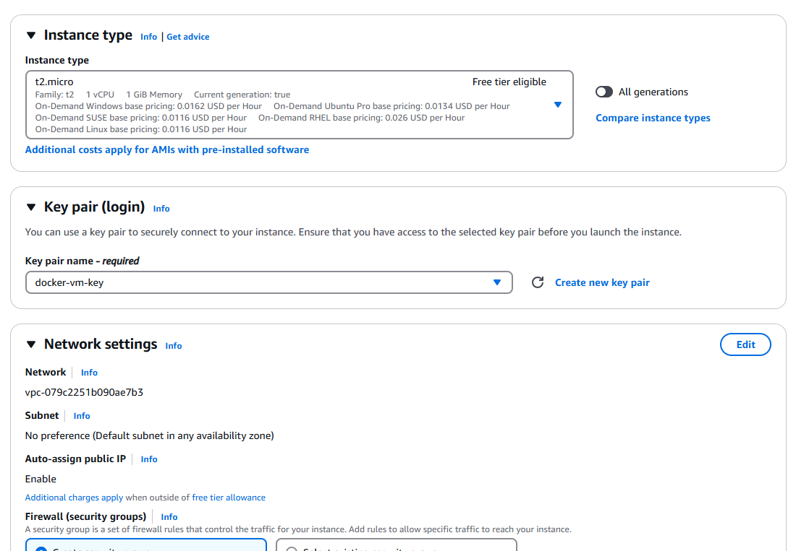
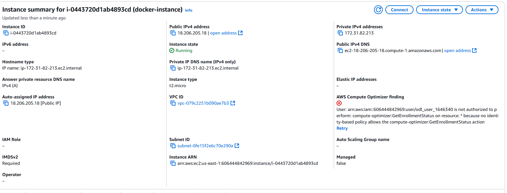

### Set up inboud rules for Web Application and API in EC2
- 8080 for Web Application
- 5000 for API
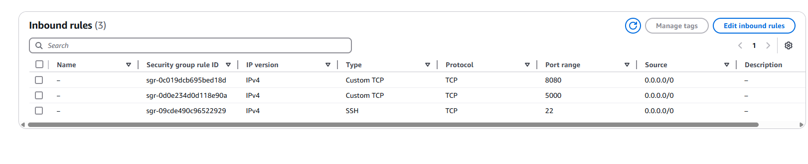

## Set up Docker on AWS EC2 Instance
### SSH into EC2 Instance
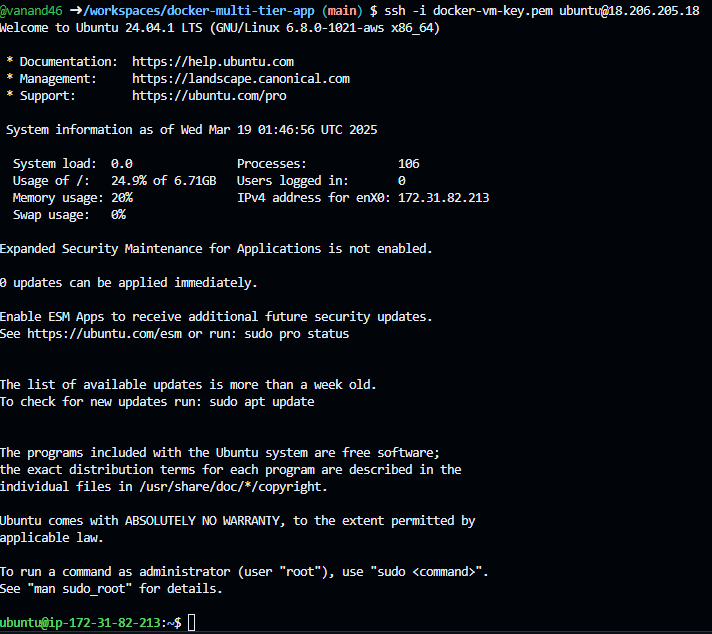
### Install Docker
```bash
$ sudo apt update -y
$ sudo apt install -y docker.io docker-compose git
$ sudo systemctl start docker
$ sudo systemctl enable docker
```
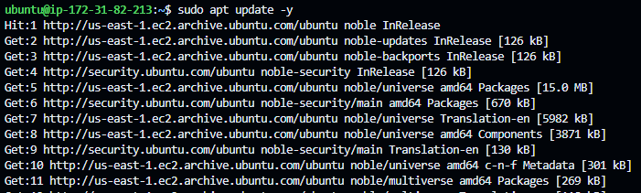
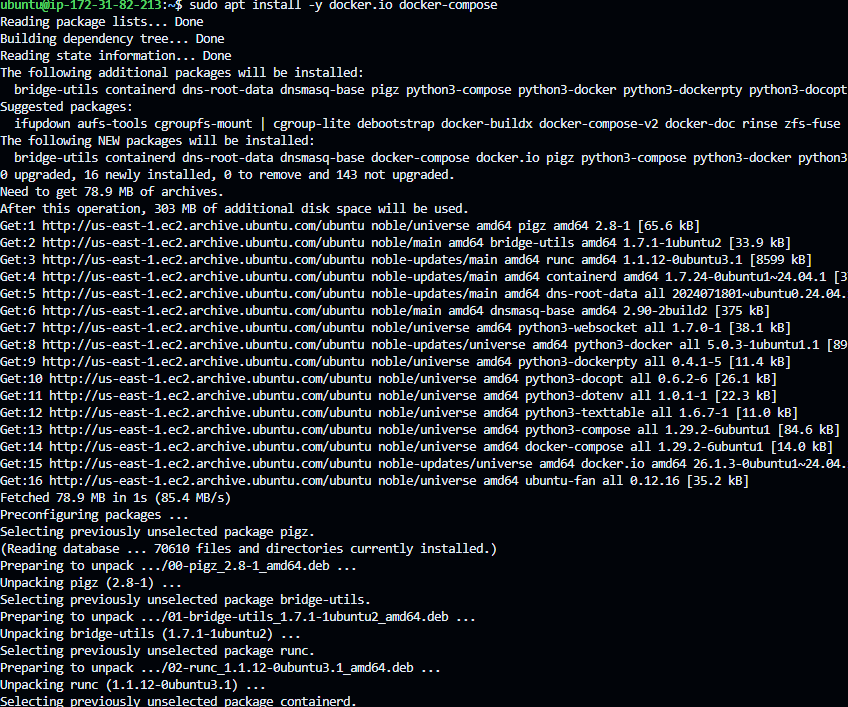
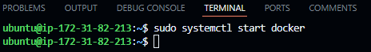
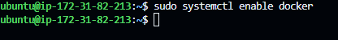
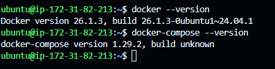

### Verify the Docker Installation
```bash
$ docker --version
$ docker-compose --version
```

## Clone the Application Repo
```bash
$ git clone https://github.com/vanand46/docker-multi-tier-app.git
$ cd docker-multi-tier-app/
```
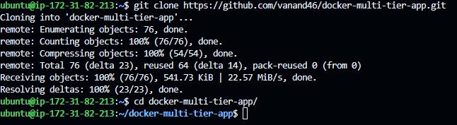


## The Application Directory structure as follows
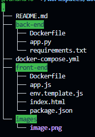

### Create the front-end Dockerfile with following content
```Dockerfile
# Use Apache as the base image
FROM httpd:2.4-alpine

# Copy frontend files to the Apache web server directory
COPY index.html /usr/local/apache2/htdocs/
COPY app.js /usr/local/apache2/htdocs/

# Modify Apache configuration to listen on port 8080
RUN sed -i 's/Listen 80/Listen 8080/g' /usr/local/apache2/conf/httpd.conf

# Expose port 8080
EXPOSE 8080

# Start Apache in the foreground
CMD ["httpd", "-D", "FOREGROUND"]
```

### Create the back-end Dockerfile with following content
```Dockerfile
# Use the official Python 3.9 image as the base image
FROM python:3.9

# Set the working directory inside the container
WORKDIR /app

# Copy the requirements.txt file to the container
COPY requirements.txt .

# Install Python dependencies
RUN pip install -r requirements.txt

# Copy the application code to the container
COPY app.py .

# Run the Flask application on container startup
CMD ["python", "app.py"]
```

### Create the docker-compose.yml of the application with the following content
```yml
# docker-compose.yml
version: '3.8'

services:
  # Frontend Service
  frontend:
    build: ./front-end  # Builds the frontend Docker image
    ports:
      - "8080:8080"  # Exposes frontend on port 8080
    depends_on:
      - backend  # Ensures backend service starts before frontend

  # Backend Service
  backend:
    build: ./back-end  # Builds the backend Docker image
    ports:
      - "5000:5000"  # Exposes backend on port 5000
    depends_on:
      - database  # Ensures database service starts before backend
    environment:
      - DB_HOST=database  # Database service hostname
      - DB_USER=user  # Database username
      - DB_PASSWORD=password  # Database password
      - DB_NAME=appdb  # Name of the database

  # Database Service
  database:
    image: mysql:latest  # Uses the official MySQL image
    restart: always  # Ensures database restarts on failure
    environment:
      MYSQL_ROOT_PASSWORD: rootpassword  # MySQL root password
      MYSQL_DATABASE: appdb  # Creates initial database
      MYSQL_USER: user  # MySQL user
      MYSQL_PASSWORD: password  # MySQL user password
    ports:
      - "3306:3306"  # Exposes MySQL on port 3306
    volumes:
      - db_data:/var/lib/mysql # persist the database data

# Persistent Volume for Database
volumes:
  db_data: 
```

## Update front-end/app.js file with EC2 instance public IP
```bash
$ nano front-end/app.js
```
```js
document.addEventListener("DOMContentLoaded", function () {
    const BACKEND_URL = "http://18.206.205.18:5000"; // Replace with your actual public IP

    fetch(`${BACKEND_URL}/`)
        .then(response => response.json())
        .then(data => {
            document.getElementById("backend-message").innerText = data.message;
        })
        .catch(error => console.error("Error fetching data:", error));
});
```

## Run the Docker Compose
```bash
$ sudo docker-compose up -d 
$ sudo docker ps
```

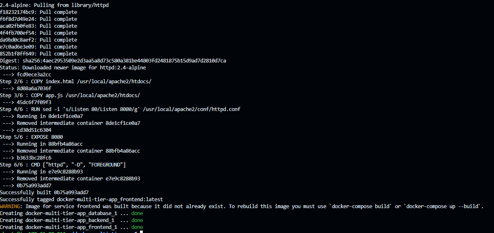
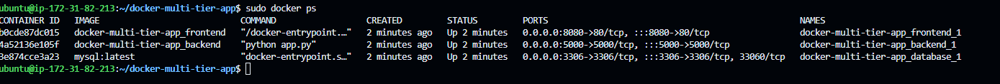

## Deployment Results

- Visit: http://18.206.205.18:8080/ to check the frontend
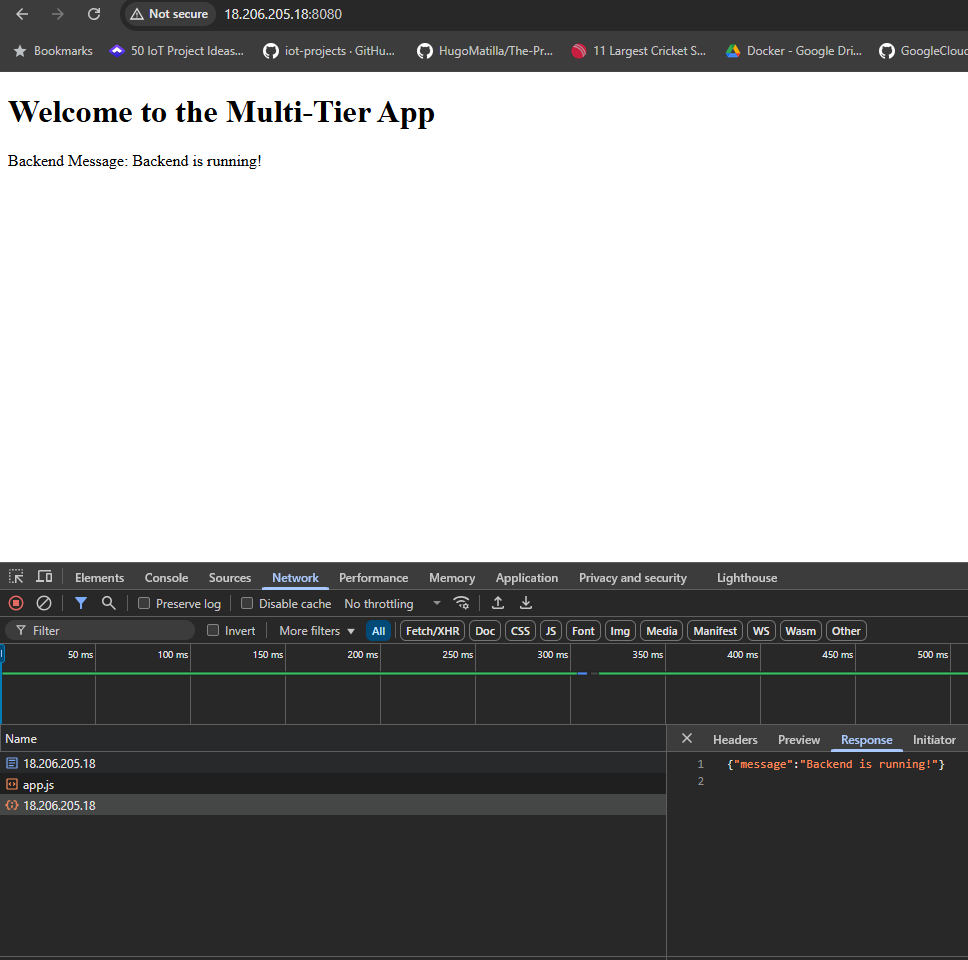
- Visit: http://18.206.205.18:5000/ to check the backend
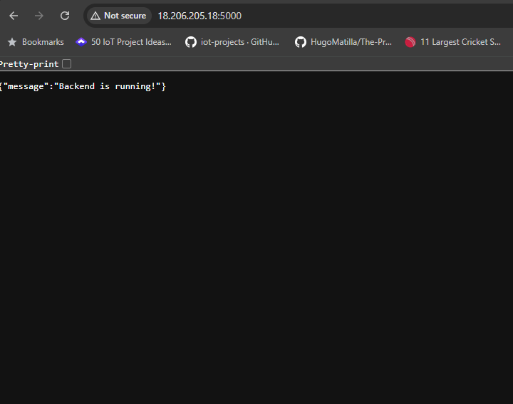

