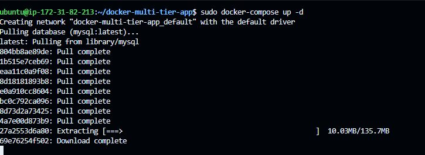
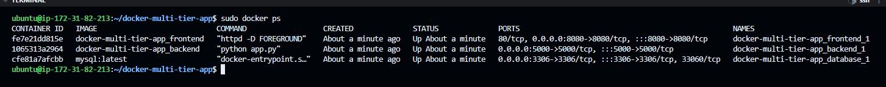

# Deploying Multi-Tier Application
This particular repo demonstrate the deployment of a multi-tier application using Docker-compose

## Set up an AWS EC2 Instance with Public IP


### Set up inboud rules for Web Application and API in EC2
- 8080 for Web Application
- 5000 for API


## Set up Docker on AWS EC2 Instance
### SSH into EC2 Instance

### Install Docker
```bash
$ sudo apt update -y
$ sudo apt install -y docker.io docker-compose git
$ sudo systemctl start docker
$ sudo systemctl enable docker
```


### Verify the Docker Installation
```bash
$ docker --version
$ docker-compose --version
```

## Clone the Application Repo
```bash
$ git clone https://github.com/vanand46/docker-multi-tier-app.git
$ cd docker-multi-tier-app/
```


## The Application Directory structure as follows


### Create the front-end Dockerfile with following content
```Dockerfile
## Use a lightweight Nginx image as the base image
FROM nginx:alpine

# Copy the frontend HTML file to the Nginx web server directory
COPY index.html /usr/share/ngnix/html/

# Copy the frontend JavaScript file to the Nginx web server directory
COPY app.js /usr/share/ngnix/html/ 

# Inject environment variables at runtime using envsubst
COPY env.template.js /usr/share/nginx/html/env.js

CMD ["/bin/sh", "-c", "envsubst < /usr/share/nginx/html/env.js > /usr/share/nginx/html/env.js && exec nginx -g 'daemon off;'"]
```

### Create the back-end Dockerfile with following content
```Dockerfile
# Use the official Python 3.9 image as the base image
FROM python:3.9

# Set the working directory inside the container
WORKDIR /app

# Copy the requirements.txt file to the container
COPY requirements.txt .

# Install Python dependencies
RUN pip install -r requirements.txt

# Copy the application code to the container
COPY app.py .

# Run the Flask application on container startup
CMD ["python", "app.py"]
```

### Create the docker-compose.yml of the application with the following content
```yml
version: '1.0'

services:
  
  # Frontend Service
  frontend:
    build: ./front-end  # Builds the frontend Docker image
    ports:
      - "8080:80"  # Exposes frontend on port 8080
    depends_on:
      - backend  # Ensures backend service starts before frontend
    environment:
      - BACKEND_URL=${BACKEND_URL}  # Loads backend URL from the .env file

  # Backend Service
  backend:
    build: ./back-end  # Builds the backend Docker image
    ports:
      - "5000:5000"  # Exposes backend on port 5000
    depends_on:
      - database  # Ensures database service starts before backend
    environment:
      - DB_HOST=database  # Database service hostname
      - DB_USER=user  # Database username
      - DB_PASSWORD=password  # Database password
      - DB_NAME=appdb  # Name of the database

  # Database Service
  database:
    image: mysql:latest  # Uses the official MySQL image
    restart: always  # Ensures database restarts on failure
    environment:
      MYSQL_ROOT_PASSWORD: rootpassword  # MySQL root password
      MYSQL_DATABASE: appdb  # Creates initial database
      MYSQL_USER: user  # MySQL user
      MYSQL_PASSWORD: password  # MySQL user password
    ports:
      - "3306:3306"  # Exposes MySQL on port 3306

# Persistent Volume for Database
volumes:
  db_data:              
```

## Update .env file with EC2 instance public IP
```bash
$ nano .env
```
```bash
BACKEND_URL=http://18.206.205.18:5000
```

## Run the Docker Compose
```bash
$ sudo docker-compose up -d 
$ sudo docker ps
```



